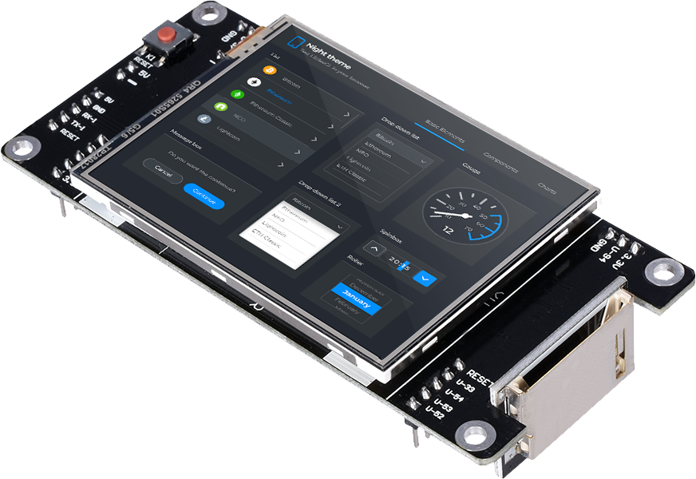
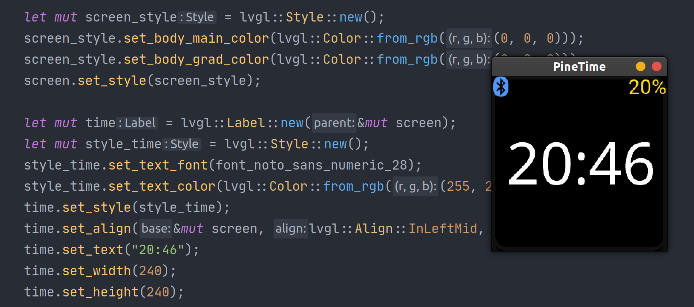

<h1 align="center"> LVGL - Open-source Embedded GUI Library in Rust</h1>



<p align="center">
LVGL provides everything you need to create a Graphical User Interface (GUI) on embedded systems with easy-to-use graphical elements, beautiful visual effects and low memory footprint. 
</p>
<p align="center">
LVGL is compatible with <samp>#![no_std]</samp> environments by default.
</p>

<h4 align="center">
<a href="https://github.com/rafaelcaricio/lvgl-rs-wasm">Rust to WASM demo</a> &middot;
<a href="https://lvgl.io/">Official LVGL Website </a> &middot;
<a href="https://github.com/littlevgl/lvgl">C library repository</a> &middot;
<a href="https://lvgl.io/demos">Official live demos</a>
</h4>

---



## System Build Dependencies

In order to build the `lvgl` project you will need the following system dependencies to be installed:

```
$ sudo apt install build-essential llvm clang
```

If you want to build the examples, then you will need to install SDL2 as well.

```
$ sudo apt install libsdl2-dev
```

## Usage

Edit your `Cargo.toml` file dependencies with:
```
$ cargo add lvgl
```

The build requires the environment variable bellow to be set:

- `DEP_LV_CONFIG_PATH`: Path to the directory containing the `lv_conf.h` header file used for configuration of LVGL library.

We recommend the `lv_conf.h` file to be in your project's root directory. If so, the command to build your project would be:
```shell script
$ DEP_LV_CONFIG_PATH=`pwd` cargo build
```

### Building for embedded environments

We make use of `bindgen` for generating the bindings to LittlevGL at build time. There is a problem in cargo when building
for `no_std`, so we need to use a workaround to build "lvgl-rs". The mainstrem issue in cargo is being tracked at
[rust-lang/cargo#7915](https://github.com/rust-lang/cargo/issues/7915).

```shell
$ DEP_LV_CONFIG_PATH=`pwd` cargo build -Zfeatures=build_dep
```
### LVGL Global Allocator

A [global allocator](https://doc.rust-lang.org/std/alloc/trait.GlobalAlloc.html) for Rust leveraging the
[LVGL memory allocator](https://github.com/lvgl/lvgl/blob/master/src/misc/lv_mem.h) is provided, but not enabled 
by default. Can be enabled by the feature `lvgl_alloc`. This will make all dynamic memory to be allocated by LVGL 
internal memory manager.

## Running the demo

**Hint for macOS users**: Before you run the demos you need to make sure you have [libsdl](https://www.libsdl.org)
installed on your machine. To install it, use HomeBrew:

```shell
$ brew install sdl2
```

[This project contains examples that can run in a desktop simulator.](./examples)

First, make sure to pull `lvgl-rs` submodules:
```shell
$ git submodule init
$ git submodule update 
```

Then run the `demo` example:

```shell
$ DEP_LV_CONFIG_PATH=`pwd`/examples/include cargo run --example demo
```

## Feature Support

The bindings are still in development. There are many features of LVGL that needs to be exposed by `lvgl-rs`. In
this section you can check what is implemented at the moment.

### Features

List of LVGL features that impacts the library usage in general.
- [x] Displays: We use [`embedded_graphics`](https://docs.rs/embedded-graphics/0.6.2/embedded_graphics/) library to
      draw to the display. You can use `lvgl-rs` with any of the
      [`embedded_graphics` supported displays](https://docs.rs/embedded-graphics/0.6.2/embedded_graphics/#supported-displays).
- [x] Events: You can listen and trigger events in widget objects.
- [x] Styles: You can set styles in any exposed object. We are still missing the possibility of defining global base styles.
- [ ] Input Devices
- [ ] Fonts
- [ ] Images
- [ ] File system
- [ ] Animations
- [ ] Tasks

### Widgets

Widgets currently implemented might have some missing features. If the widget you want to use is not exposed or
is missing a feature you want to make use, please send a Pull Request or open an issue.
